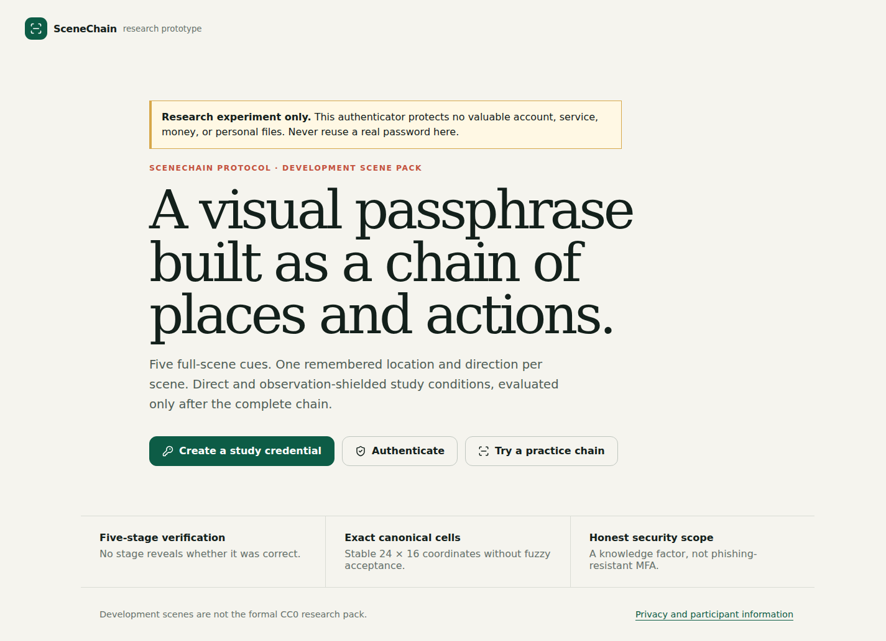
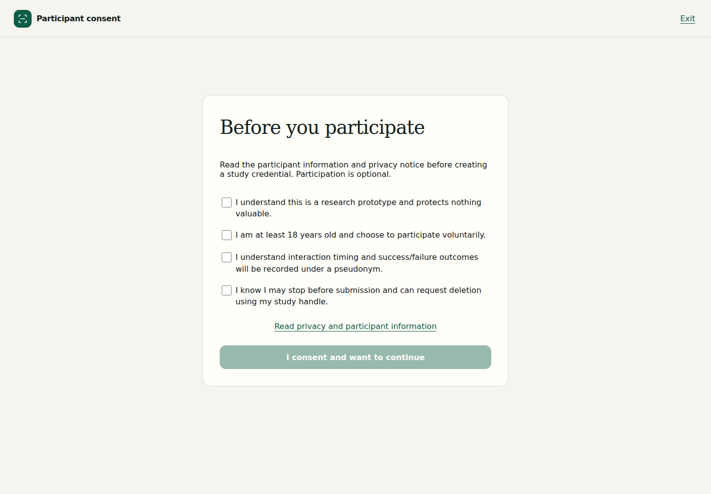
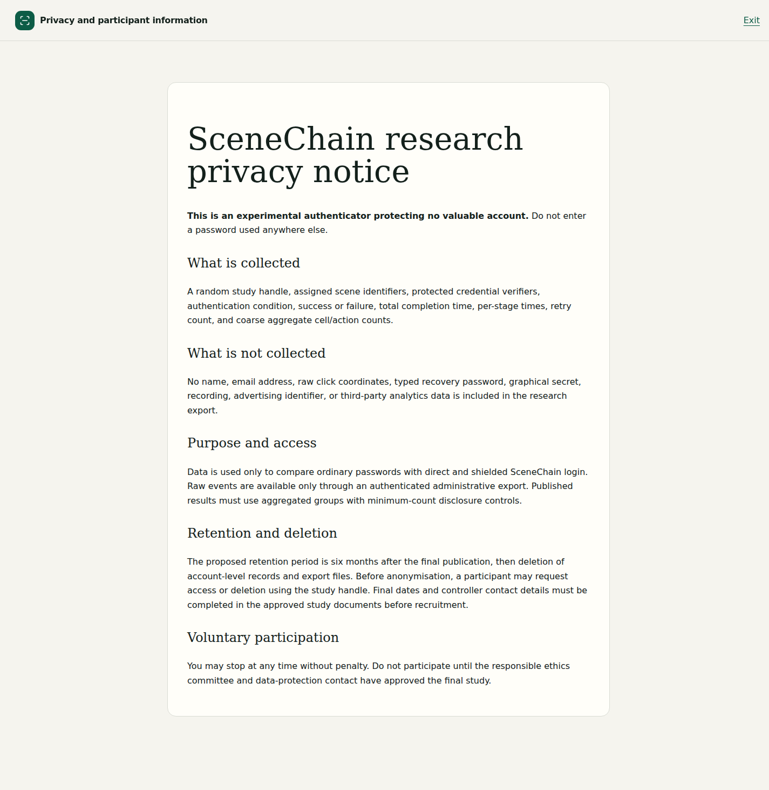
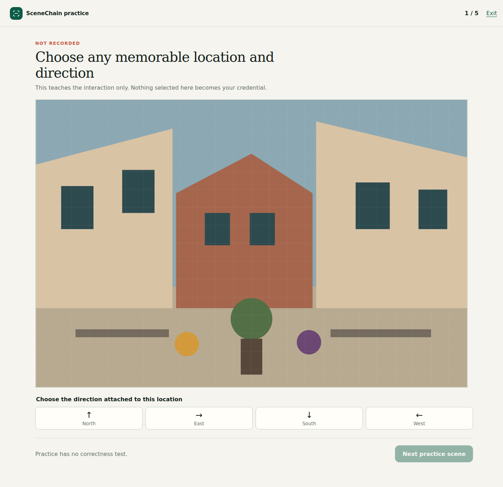
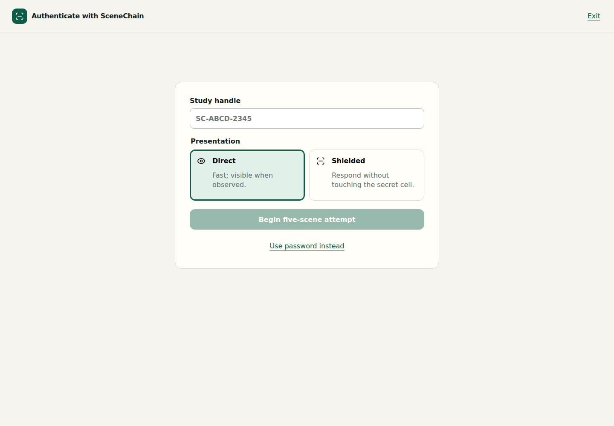
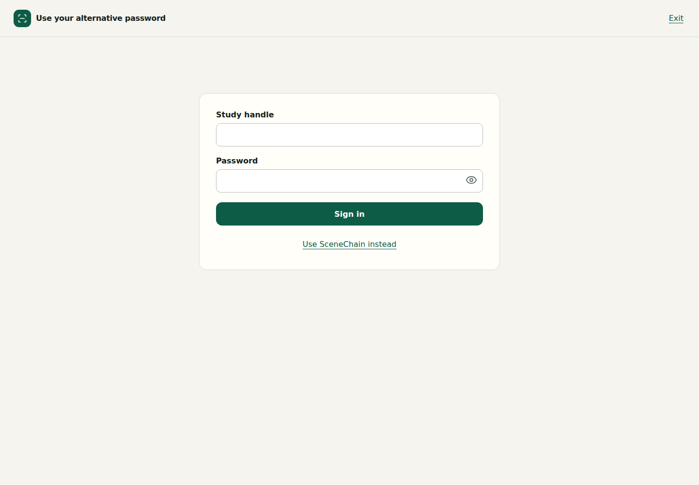
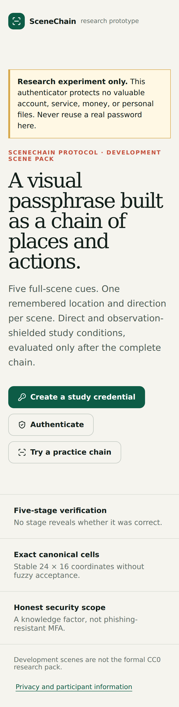
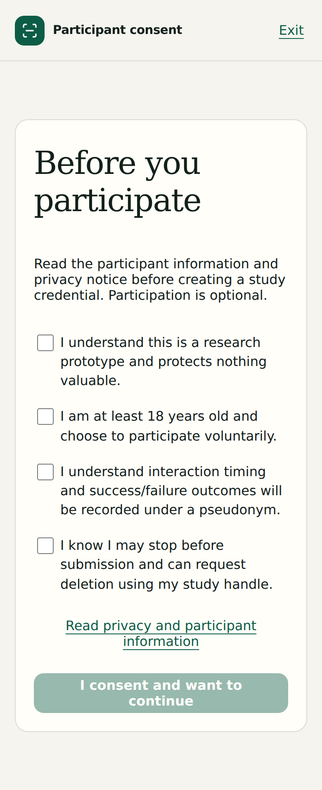

# SceneChain protocol and implementation review

Review date: 2026-07-22

## Verdict

SceneChain is a credible authentication prototype with a thoughtful threat model, a polished visual language, sound basic credential cryptography, and unusually honest security disclaimers. It is not yet a runnable confirmatory research experiment and should not recruit participants in its current state.

The largest gap is not external ethics approval. The preregistered study and the software describe different systems. The application lets a participant freely choose password, direct, or shielded login, while the protocol requires a randomized, six-sequence, three-period crossover with standardized practice, timed trials, follow-up, workload, accessibility, observation, recovery, and lockout measures. The data model cannot represent that experiment and password attempts are not recorded at all.

No product source was changed during this review. The screenshots in this folder are current captures of the checked-in production build served locally. The backend was unavailable because Docker Desktop was stopped, so backend and full-flow runtime tests could not be repeated.

## Release blockers

### The confirmatory experiment is not implemented

`App.tsx` exposes independent navigation choices rather than an assigned study session. There is no participant allocation, sequence, period, trial, practice criterion, follow-up visit, questionnaire, observer task, lockout task, or deviation/system-failure record. `study_events` has no fields for these concepts. The planned mixed model therefore cannot be reconstructed from the export.

Required change: add an explicit study-session state machine and schema before changing the UI. Allocate one of the six Williams sequences in balanced blocks; persist sequence, period, condition, trial number, planned-versus-practice status, visit, device profile, and technical-failure status; enforce the assigned condition server-side.

### The primary comparison has no password observations

`AuthController.password` verifies the password and creates a session, but neither accepts a measured duration nor records a password event. `PasswordLogin` also has no timer. The primary direct-versus-password hypothesis is therefore unanswerable.

Required change: measure password trials from a precisely defined readiness event, record known-account success and failure, derive retry count on the server, and distinguish authentication failures from technical failures. Do not accept arbitrary client timing without a study-session/trial token and server-side timestamps.

### Hotspot collection is broken

`HotspotAggregateRepository.increment` has three SQL placeholders but supplies four arguments because the SQL hard-codes scene version `1`. The exception is swallowed by enrollment, so accounts can be created while hotspot counts silently fail.

Required change: use a placeholder for `scene_version`, add a real repository integration test, and make research-metric failure observable to operators without failing authentication.

### Double confirmation is client-only

The browser compares two confirmation passes, but `/api/enrollments/complete` accepts one five-stage chain. A modified client can bypass the frozen two-confirmation rule and create a mistyped credential.

Required change: store the first complete chain in expiring server-owned enrollment state, accept two subsequent complete confirmations, compare only after each full chain, and persist only after both match.

### The frozen credential test vector is wrong

The JSON vector declares a final action of `0` but ends the encoded value in `07`. Fresh canonical encoding ends in `00`, which is also what `ProtocolTest` expects. CI checks only that the JSON parses and never runs the shared vector.

Required change: regenerate the vector to end in `00`, load that same file from Java tests, add an independent TypeScript encoder/decoder test if TypeScript is intended to implement the wire format, and make vector conformance a CI gate.

### The scene-pack freeze is documentary, not enforced

The backend accepts any structurally valid 48-scene `approved` manifest. It does not enforce the frozen manifest SHA-256, verify delivery WebP hashes, or fail production startup when the formal pack is absent. The manifest contains canonical hashes but no delivery hashes or signature. A production misconfiguration silently enables the development pack.

Required change: pin the expected manifest digest in production configuration, include and validate delivery hashes, package immutable assets into the release image, and disable enrollment/authentication unless the exact formal pack is loaded. Call the artifact a digest freeze unless it is actually digitally signed.

## Protocol and statistical design

### The primary estimand does not match the stated goal

“Direct SceneChain differs from manual password entry” is a two-sided superiority test. It cannot support “similar performance.” If comparable performance is the scientific claim, specify a non-inferiority or equivalence margin in interpretable units, such as a maximum acceptable geometric-mean time ratio and a maximum success-rate loss. Justify those margins before the pilot is inspected.

“Successful practiced-login duration” conditions on success and can favor a harder method by discarding its failures. Define the exact measured trial or aggregation rule and either use a joint success/time estimand, a time-to-success endpoint with a fixed attempt horizon, or separate success non-inferiority from conditional completion time.

### The crossover is under-specified

The six sequences are not listed; allocation generation and concealment are absent; period length, trial count, washout/delay, carryover handling, practice criterion, standardized device, browser, network, instructions, and exact follow-up interval are undefined. Direct and shielded mode reuse the same graphical credential, so learning and carryover are plausible and must be designed for, not only adjusted with a period term.

Required change: publish the six sequences (`ABC`, `ACB`, `BAC`, `BCA`, `CAB`, `CBA` or a justified Williams design), blocked allocation method, number of measured attempts per period, practice rule, rest interval, follow-up window, and a model including sequence/period plus a prespecified carryover sensitivity analysis.

### The power analysis is too detached from the model

The calculation is a normal approximation for a paired standardized effect, while the primary analysis is a log-time mixed model. `dz = 0.35` has no pilot-based standard deviation, correlation, time ratio, or practical justification. Secondary observation, success, retention, and accessibility outcomes are explicitly not powered, so they should not be framed as conclusions.

Required change: obtain a separate pilot, estimate within-participant log-time variation without using confirmatory participants, translate the smallest effect into a time ratio, and use exact or simulation-based power for the frozen mixed model. Keep 90 as a maximum only after making the stopping rule logically attainable when fewer than 72 of 90 are analyzable.

### Outcomes and procedures need operational definitions

Specify the workload instrument and scoring, usability instrument, comprehension check, accessibility-barrier coding, delayed-retention interval, recovery task, lockout task, observation instructions, observer/target allocation, number of guesses, success definition, recording policy, and separate observer-study sample-size rationale. The current allowlist cannot store observer view count or outcome.

### Recommended cells confound the hotspot question

All 384 cells are technically selectable, but 192 cells per scene are visibly outlined as recommended. That is an enrollment nudge and will change the distribution the study later calls “natural” hotspot behavior.

Required change: either remove recommendations in the confirmatory usability comparison or randomize a separate `unguided` versus `recommended` enrollment factor with its own hypothesis and power. Do not infer the effect of guidance from one guided condition.

## Security analysis

### Shielded mode has a much smaller online response space

Direct mode has `(384 * 4)^5`, approximately 52.9 configured bits after scene disclosure. Shielded verification accepts one of eight marker values and one of four directions per stage, so a fresh challenge exposes only `(8 * 4)^5 = 2^25` response combinations after scene disclosure. Four cells also share a permanent 2-by-2 tile and are indistinguishable to the shielded verifier.

An ideal-observer simulation of the implemented balanced overlay, assuming scenes and directions were visible and the attacker optimally answers a fresh overlay, produced approximately:

| Recorded logins | Mean candidate tiles per stage | Optimal complete-chain success on a fresh challenge |
|---:|---:|---:|
| 0 | 96.00 | 0.0031% |
| 1 | 12.00 | 0.15% |
| 2 | 2.28 | 8.9% |
| 3 | 1.14 | 73% |

These are model-based values, not participant results, but they show that “one to three views” is not a minor degradation range. The protocol must state the 25-bit response space and set a success threshold in advance. If three-view resistance matters, redesign the challenge before recruitment; otherwise scope shielded mode explicitly to one opportunistic observation.

### Abuse controls do not match the documented design

The code uses `request.getRemoteAddr()`, while Nginx proxies requests without `X-Forwarded-For`. In the Compose topology the backend will normally see the proxy address, collapsing every participant into one network bucket. There is also no increasing delay, temporary account suspension, trusted-client-IP design, or Argon2 concurrency semaphore despite documentation claiming those controls. The 100-per-15-minute network limit can block an entire lab or NAT.

Required change: define one trusted proxy boundary, sanitize and forward the client address, test multi-client/NAT behavior, add account failure state with usable retry information, and enforce a bounded Argon2 work queue or semaphore.

### Administrative export is weaker than documented

The export is a public API route protected by one static header secret. It uses the ordinary lookup key for research pseudonyms, has no administrative identity, reauthentication, authorization role, audit record, asynchronous job, row limit, or separate database role. The runtime application role has CRUD access to all tables.

Required change: move export behind a non-public administrative boundary, use a separate pseudonymization key, record audited operator access, stream bounded exports, and separate authentication, aggregate, migration, and research-reader database privileges.

### Key and lifecycle claims exceed the implementation

Production requires non-empty secrets but does not reject development values, short values, or reused values. Database `key_version` is not used for selection or rotation. Sessions renew their TTL on every `/api/me`, so “at most one hour” is currently an idle timeout, not an absolute lifetime. Disabled accounts remain usable through an existing session because `/api/me` does not check `enabled`.

Required change: validate production secret strength and separation at startup, implement actual key-version lookup/rotation, separate idle and absolute session expiry, and reject or revoke sessions for disabled/deleted accounts.

## Privacy and ethics implementation

### Consent evidence is inadequate

The server receives four booleans and stores only `consented_at`. It does not store the information-sheet version, consent-text version, individual purposes, locale, withdrawal state, or ethics reference. The browser sends all four booleans as hard-coded `true` after navigation, so the backend cannot prove which text the participant saw.

Required change: version the approved participant information and consent statements, store the accepted version and granular choices, make optional observation consent separate, and implement withdrawal. Complete controller, contact, legal-basis, processor, recipient, transfer, and supervisory-authority fields before recruitment.

### Promised access and deletion are not implemented

There is no participant access, withdrawal, or deletion endpoint/tool, no deletion audit, and no scheduled retention job. `study_events.subject_id` is not a foreign key, so deleting an account would not delete its events automatically. The claimed separation between authentication identity and research identity is also absent: study events store the account UUID directly.

Required change: add a controlled operator workflow that verifies the study handle, deletes account, assignments, credentials, sessions, and study events transactionally, records a non-identifying deletion receipt, handles backups, and tests the process. Use a separate random study subject ID and protected linkage table if the approved design needs linkage.

### The participant notice and implementation diverge

The notice says retry count and coarse aggregates are collected, but retry count is always zero and aggregate writes currently fail. Exact timestamps and event IDs are exported but are not prominent in the notice and can be linked to appointment times. The browser notice states only six months after publication, omitting the separate 24-month collection-close cap.

Required change: generate participant-facing text from an approved data inventory, remove unneeded exact timestamps/event IDs or justify them, and verify every described field against a database/export contract test.

## Performance and accessibility

### Full-pool privacy currently costs too much

The 48 WebPs total 11,974,592 bytes and can require roughly 472 MiB of decoded RGBA pixel memory at 1920 by 1280. The gallery loads all full-resolution images without thumbnails or lazy loading. Nginx's immutable-cache rule covers SVG, JS, and CSS but not WebP. This is not comparable to ordinary password utilization and is risky on mobile devices.

Required change: add fixed, hashed recognition thumbnails; include WebP/AVIF in immutable caching; preload or package full-size assets without logging selected-scene fetches; measure cold and warm LCP, decode memory, data transfer, and low-end-device behavior. Preserve the privacy property when optimizing asset requests.

### Keyboard support is not practical accessibility

Each scene exposes 384 sequentially focusable buttons. There is no roving `tabindex`, arrow-key grid navigation, selected-cell `aria-pressed`, focus restoration after stage changes, or announcement of new stages. The presentation selector is visually selected but does not expose radio or pressed state. Password inputs are not inside forms, so Enter submission is not guaranteed.

Required change: implement a semantic grid with one Tab stop and arrow navigation, announce row/column and state, restore focus to each stage heading, expose presentation as radios, use forms, and test with NVDA, VoiceOver, keyboard-only, 200/400% zoom, forced colors, and reduced motion.

### Mobile reflow changes the studied task

Below 900 CSS pixels the scene remains 768 pixels wide in a horizontal scroll container. It avoids tiny targets but prevents seeing the complete scene while choosing a location. That changes recognition and timing and conflicts with the frozen desktop study assumption.

Required change: either reject unsupported viewports before consent and standardize the lab device, or define and separately validate a mobile protocol. Do not pool desktop and mobile timings.

## Documentation consistency

Several documents are stale enough to mislead a reviewer:

- `scene-pack.md` still says only 192–240 cells are eligible and describes guided windows; the frozen manifest makes all 384 eligible and uses 192 recommendations.
- `review-2026-07-10.md` retains eight actions and guided windows; implementation has four actions and unrestricted cells.
- `scene-pack-selection.md` says the pack is not frozen.
- `architecture.md` says PostgreSQL contains passkeys and separate database roles that do not exist.
- the threat model lists guided windows as a hotspot control and a separately encrypted linking table that are not implemented.
- the ASVS evidence map is a short project summary, not a complete ASVS 5.0 Level 2 mapping.

Required change: retire superseded design notes to a clearly labelled archive, make one protocol and one data dictionary normative, and add automated conformance checks for constants, manifest digest, event fields, consent version, and protocol vectors.

## Confirmed strengths

- Direct and shielded graphical verification return only a final result.
- Attempt identifiers, CSRF tokens, and sessions have adequate random sizes and server-side TTL storage.
- Attempt consumption uses Redis `GETDEL`, providing atomic single use.
- Password and graphical verifiers use Argon2id with 19 MiB, two iterations, and one lane, unique salts, account binding, and a separate HMAC pepper.
- Shielded metadata uses AES-GCM with a random 96-bit nonce and account/version AAD.
- The full 48-scene response prevents direct account-scene disclosure in response content.
- Authentication pages are same-origin and self-hosted with CSP, frame denial, no-store API responses, and no third-party analytics.
- The participant-facing warning that the system protects no valuable account is clear and prominent.
- The current manifest hash matches the documented digest and the structural/canonical hash validator passes.
- The locked frontend dependency audit reported zero current advisories.

## Participant-flow audit

The current static production build was captured at 1440 by 1000 and 390 by 844. The formal backend flow could not be reached because Docker Desktop was stopped.

1. Landing — visually strong, responsive, and clear about experimental scope; blocked for formal use because unknown pack status is rendered as “development” and enrollment is not disabled.

   

2. Consent — readable and uncluttered; unhealthy as consent evidence because it is incomplete, unversioned, and not server-verifiable.

   

3. Privacy notice — readable, but its data/retention claims diverge from the implementation and the only Exit action returns to the home screen instead of the consent screen.

   

4. Practice — visually clear; incomplete because it teaches only direct cell/action entry and not full-pool recognition or shielded markers.

   

5. Graphical login entry — clean hierarchy; unsuitable for the study because participants choose the condition rather than follow assigned sequence, and selection state lacks radio semantics.

   

6. Password login — conventional and password-manager friendly; missing timing, research-event capture, form submission semantics, and assigned-trial context.

   

7. Mobile landing — reflows without clipping; long and oversized but usable.

   

8. Mobile consent — no visible horizontal overflow; typography and card spacing are large, but the larger blocker remains consent completeness and workflow.

   

## Fresh verification record

Passed:

- scene-pack structural and canonical hash validation;
- documented manifest SHA-256 comparison;
- Java compilation of `Protocol` and `MarkerOverlay`;
- Python script compilation and JSON syntax checks;
- frontend ESLint;
- frontend TypeScript project build;
- npm audit: zero low, moderate, high, or critical advisories;
- current static-browser captures at desktop and phone widths.

Confirmed failure:

- published credential vector ends in `07`; canonical encoding and Java test expectation end in `00`.

Blocked, not passed:

- Maven/JUnit suite: Maven is unavailable locally and Docker Desktop is stopped;
- full integration and negative-security scripts: no backend stack is running;
- Vitest/Vite execution with the available Windows Node runtime: checked-out `node_modules` contains the Linux Rollup optional binary, not the Windows binary;
- production TLS, proxy logs, trusted client IP, Redis/PostgreSQL permissions, timing-enumeration distributions, assistive technology, and real-device performance.

## Recommended next pass

Do not polish or deploy first. Unfreeze the preregistration while no participants have been recruited, decide the actual primary estimand and whether shielded mode is intentionally a one-observation defense, then implement the study-session/data model. After that, repair conformance and privacy blockers, replace stale documentation, rerun the full stack and independent security tests, conduct a small non-confirmatory pilot, redo power from pilot variance, submit the final materials for ethics/data-protection review, preregister, and only then freeze the recruitment release.
